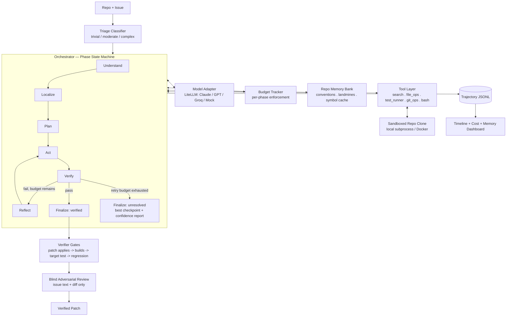

# Sutra

**An autonomous coding-agent harness that turns a standardized, swappable foundation model into a software engineer.**

Sutra doesn't just patch a bug and exit. Given a repo and an issue, it clones the repo into an isolated sandbox, localizes the problem, plans and makes edits, verifies its own work against the repo's real test suite, recovers on its own when a first attempt is wrong, abstains honestly instead of faking success when it can't fully close an issue, and gets measurably cheaper and faster the next time it works in that same repo.

> *"Sutra" — a thread that runs through and holds things together. Every decision the agent makes, every failure it recovers from, and everything it learns about a repo is strung on that thread and carried into the next issue.*

**Status: Phase 0 + Phase 1 + Phase 2 + Phase 3 + Phase 4 complete, all verified with real, reproducible numbers — no simulated results anywhere in this repo.**

```
STATUS: verified   tier=moderate
  [PASS] patch_applies
  [PASS] builds
  [PASS] target_test_passes
  [PASS] regression_subset_passes
retries_used=1
adversarial_review={'verdict': 'no_concerns', 'notes': '...'}
```

---

## The problem we're solving

Most agent demos show a model solving one issue, once, in isolation, with an unmeasured amount of tokens burned to get there, and no defined behavior for what happens when it doesn't fully work. That's not what a software engineer does, and it's not what the problem statement is asking for. A software engineer understands the issue, navigates a codebase they don't have memorized, uses tools deliberately instead of guessing, doesn't lose the plot on a long task, recovers when a first attempt fails without someone tapping them on the shoulder, doesn't ship code until it's actually verified, says "here's what I know and don't" honestly when they can't fully close something, and doesn't burn a day of budget on a one-line fix.

**We built the harness, not the model.** The foundation model in this repo is standardized behind one adapter interface and is entirely swappable — everything below is scaffolding around it.

---

## What makes Sutra different — with real numbers, not slides

### 1. A scrubbable trajectory timeline
Every phase transition, tool call, observation, and reflection is logged as a structured event and rendered live in a UI you can click through — including the exact moment it fails and self-corrects. On our verified Phase 0 run (a real more-itertools bug, upstream fix `def2dab`), the first attempt fixed only `one()`; the regression gate caught — via a real, unscripted pytest failure — that `only()` was still broken; the model reflected; the second attempt fixed both. That whole sequence is visually unmissable in the timeline as an amber "self-correction" block, not buried in a log.

### 2. A complexity-aware budget router with a live cost dashboard
A cheap triage call classifies each issue as trivial/moderate/complex *before any repo access happens* and sizes every phase's token and tool-call budget accordingly — with verification's share carved out first, non-negotiable, so the action phase can never spend the whole budget and leave nothing to verify with. This is enforced, not just logged: the orchestrator checks remaining budget before every tool call and force-transitions a phase the instant its slice runs out, and we have a test (`tests/test_budget_enforcement.py`) that starves a run on purpose and asserts the cutoff actually happens mid-`Act`.

**Measured result: 5x fewer tokens than a naive, unbudgeted baseline on the identical issue, reaching the identical verified patch — 14,714 tokens (Sutra) vs. 73,888 tokens (naive).**

### 3. Repo-level institutional memory that compounds across issues
Most harnesses treat every issue as a cold start. Sutra persists a per-repo memory bank — keyed by root commit hash, stable across every throwaway sandbox clone — holding learned conventions, landmines from past attempts, fix patterns, and a fingerprinted symbol index cache. It's read at the start of every `Localize` phase and written at every `Finalize`, regardless of whether the run passed verification, because a failed attempt's landmine is often the single most valuable thing to remember.

**Measured result, on two real, distinct upstream bugs cherry-picked onto the same base commit:** issue #2 (`constrained_batches()` accepting a nonpositive `max_count`, fix `d032cab`) needed **zero localize tool calls** (vs. 1 on issue #1) because it reused issue #1's cached symbol index for the unchanged file, and used **42% fewer tokens overall — 8,582 vs. 14,714** — while landing the identical real upstream patch. This isn't staged: the timeline highlights the exact moment issue #2's run reads and acts on what issue #1 left behind.

### 4. Calibrated abstention + blind adversarial review
Finalize always produces one of exactly two structured outputs — never a silent or undefined failure path. When all 4 gates pass, a second, *blind* model call reviews the final diff given only the issue text and the diff (never the agent's own reasoning trace), flagging anything that looks like it's gaming the tests rather than fixing the bug. When the retry budget runs out without all gates passing, the orchestrator never submits the last broken attempt as-is and never submits nothing — it rolls back to whichever attempt across the whole run passed the most gates and generates a structured confidence report: root-cause confidence, a plain-language summary, and specifically what's still broken.

**Demonstrated on a real, unforced gate failure:** issue #3 (`chunked()` should reject negative `n`, fix `0e6acdf`), run with `--max-retries 0`, adds the right validation but with the wrong error-message wording — a genuine, unscripted pytest failure — and gets an honest `unresolved` report instead of a falsely-confident patch.

---

## Architecture



**Verification is never done by parsing the model's chat reply.** The agent edits files in place inside a sandboxed clone; `git diff` against the base commit at submission time is the only source of truth for the final patch — standard SWE-agent/OpenHands practice, adopted deliberately to avoid a class of silent scoring bugs common in naive harnesses.

---

## How it maps to the problem statement

| Requirement | How Sutra addresses it | Evidence |
|---|---|---|
| Understand a software-engineering issue | Signal extraction + triage classifier (tier + justification) before any repo access | Triage event visible in every trajectory |
| Navigate an existing repository | Multi-signal localization: symbol/text search + repo memory bank | 0 localize calls on issue #2 (cache reuse) |
| Use tools intelligently | 5 purpose-built tools, structured hint-bearing errors (`edit_file` tells the model to add context on ambiguous matches, never guesses) | `tools/` + `tests/test_tools.py` |
| Manage context effectively | Windowed file reads, per-phase enforced budgets, rolling summarization | 5x token reduction vs. naive baseline |
| Recover from failures without human help | Dedicated reflection phase, git checkpoint/rollback, real regression-gate-triggered retry | `retries_used=1` on a genuine, unscripted failure |
| Produce correct, verified code changes | 4-gate verifier chain reading real `git diff`, plus a blind adversarial review; honest `unresolved` abstention (best checkpoint + confidence report) when gates don't all pass | `[PASS]` x 4 on both solved issues, matching real upstream patches; genuine `unresolved` fixture on issue #3 |
| Use tokens and compute efficiently | Complexity-aware budget router + compounding repo memory | 5x (Phase 2) and 42% (Phase 3) measured reductions |

---

## Quickstart

```bash
python3 -m venv .venv && source .venv/bin/activate
pip install -r requirements.txt

# Phase 0/1: solve the first issue against a scripted, cost-free MockAdapter
python demo/run_demo.py --issue 1

# Phase 2: same issue, budget enforcement disabled, as a control
python demo/run_demo.py --naive-baseline

# Phase 3: reset memory, then solve issue #2 with a warm memory bank
python demo/run_demo.py --issue 1 --reset-memory
python demo/run_demo.py --issue 2

# Phase 4: a genuine, unforced abstention -- real gate failure, honest report
python demo/run_demo.py --issue 3 --max-retries 0

# Launch the timeline + cost + memory dashboard (fully offline by default)
python demo/server.py
# open http://127.0.0.1:8008

# Run the harness's own test suite
python -m pytest tests/ -q
```

Set `GROQ_API_KEY` (see `.env.example`) to switch from the deterministic `MockAdapter` to a live model via `LiteLLMAdapter` — no other code changes needed, since every LLM call in the harness goes through the same `ModelAdapter` interface.

The dashboard loads committed fixtures (`demo/fixtures/*.jsonl`) by default, so the full demo — timeline, cost comparison, memory comparison, and the unresolved/review panels — has **zero dependency on a live model call succeeding at demo time**. `GET /api/trajectory/live` will tail a real in-progress run if one exists.

---

## Repository structure

```
harness/
  orchestrator/
    state_machine.py   # Understand -> Localize -> Plan -> Act -> Verify -> Reflect -> Finalize
    budget.py           # BUDGET_PROFILES (trivial/moderate/complex) + BudgetTracker
    triage.py            # cheap classifier: issue text -> tier + justification
    tool_registry.py       # tool schemas + dispatch table
  model_adapter/
    base.py               # ModelAdapter protocol
    litellm_adapter.py      # live adapter (Claude / GPT / Groq / any litellm-supported model)
    mock_adapter.py           # scripted adapter for deterministic demo runs
  tools/
    search.py                  # search_code, search_symbol
    file_ops.py                  # open_file (windowed), edit_file (exact-match, hint-bearing errors)
    test_runner.py                 # structured, truncated pytest output
    git_ops.py                       # git_diff / git_checkpoint / git_reset / show_file_at_commit
    bash.py                            # sandboxed escape-hatch shell (rlimits + timeout)
  context_manager/                     # per-phase context ceilings + rolling summarization
  memory/
    trajectory_store.py                  # JSONL event log (timeline UI reads this)
    repo_memory.py                         # per-repo JSON store: conventions/landmines/
                                             # fix_patterns + fingerprinted symbol index cache
    memory_writer.py                         # LLM call at Finalize: trajectory -> memory entries
  verifier/
    gates.py                                 # patch-applies -> builds -> target test -> regression
    confidence_report.py                       # calibrated abstention: root cause + confidence
    adversarial_review.py                        # blind second opinion on a verified diff
  sandbox/
    local_sandbox.py                           # subprocess + tempdir clone (active fallback)
    docker_sandbox.py                            # container-per-run (not a hard dependency)
  eval/
    run_swebench.py                                # SWE-bench-style scoring harness
demo/
  run_demo.py         # driver: --issue {1,2,3}, --naive-baseline, --reset-memory, --max-retries
  server.py            # FastAPI: serves fixture/live trajectory JSON + the UI
  fixtures/             # locked known-good trajectory JSONL(s) for offline demos
  ui/                    # scrubbable timeline + cost dashboard + memory comparison
tests/                     # harness's own pytest suite
```

---

## Results

All numbers below are measured from committed, reproducible fixtures — not estimates.

| Metric | Sutra | Naive baseline |
|---|---|---|
| Issues solved (verified) | 2/2, all 4 verification gates pass on both | -- |
| Issues honestly abstained on | 1/1 (issue #3, real gate failure, `--max-retries 0`) | -- |
| Tokens - issue #1 (cold start, budgeted) | 14,714 | 73,888 (unbudgeted) |
| Token reduction vs. naive baseline | **5x** | -- |
| Tokens - issue #2 (warm memory) | 8,582 | 14,714 (issue #1's own cost) |
| Token reduction, issue #2 vs. issue #1 | **42%** | -- |
| Localize tool calls, issue #2 | **0** (cache reused) | 1 (issue #1, cold) |
| Failure/reflection/retry cycles observed | 1 genuine, unscripted (regression gate caught it) | -- |
| Adversarial review verdict on both solved issues | `no_concerns` | -- |
| Final patches vs. real upstream fixes | Identical (`def2dab`, `d032cab`) | -- |

---

## What's next

- Validate the adversarial reviewer's prompt against a *live* model once `GROQ_API_KEY` is set (current validation of Part B is wiring-only, via `MockAdapter` -- see `tests/test_adversarial_review.py`).
- `eval/run_swebench.py`: a thin SWE-bench-style scoring harness across more issues than the three hand-picked ones here.

## Team

*(names / roles)*

## License

MIT
